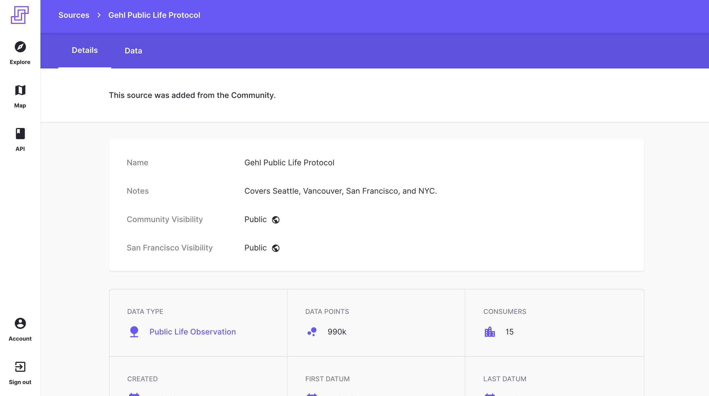

# Sample Data

To get a sense of what a final dataset will look like after a public life survey, this directory contains examples from public life surveys in San Francisco.

You can find more [example datasets hosted on Stae's site](https://sf-ca.municipal.systems/sources/fed86a0c-78a2-4b46-8d10-1ebabfcaa21e).

